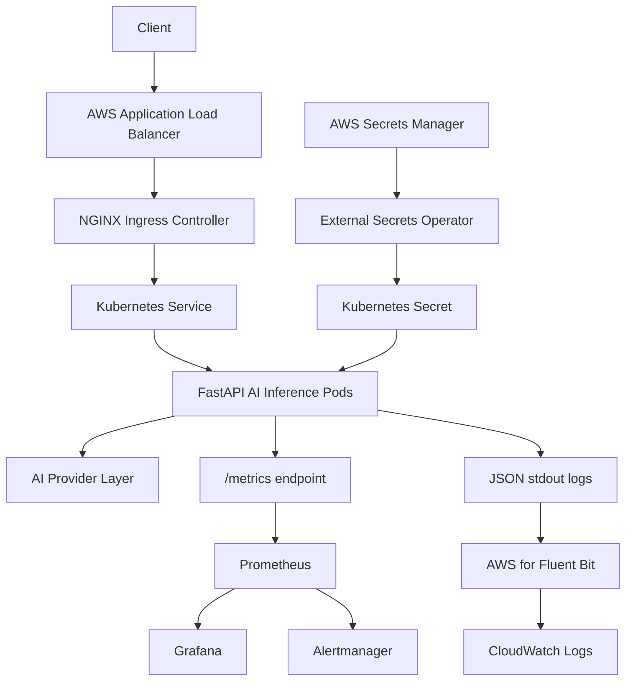

# ai-platform-kubernetes-aws

Production-inspired AI infrastructure platform on Amazon EKS.

**Owner:** Olatubosun Enoch David

**Focus:** AI Infrastructure | MLOps | DevOps | Platform Engineering | Kubernetes | AWS | SRE

## Overview

This project demonstrates how an AI inference workload can be deployed and
operated on a modern Kubernetes platform.

The FastAPI service is intentionally lightweight. The engineering focus is the
production-style platform around it: AWS infrastructure, secure workload
identity, GitOps delivery, autoscaling, ingress, secrets management,
observability, logging, rollback, troubleshooting, and cost control.

## Architecture



Detailed diagrams:

- [System architecture](architecture/diagrams/system-architecture.md)
- [Delivery flow](architecture/diagrams/delivery-flow.md)
- [Observability flow](architecture/diagrams/observability-flow.md)

## What this project proves

| Area | Implementation |
|---|---|
| Cloud infrastructure | Terraform modules for VPC, EKS, ECR, IAM, Secrets Manager, and CloudWatch Logs |
| Kubernetes packaging | Helm chart for the AI inference workload |
| GitOps | Argo CD projects and Applications for platform add-ons and the app |
| CI/CD | GitHub Actions for tests, validation, Docker build, and ECR push |
| Security | IRSA, External Secrets Operator, read-only filesystem, non-root containers, NetworkPolicy |
| Traffic | AWS Load Balancer Controller, ALB-to-NGINX bridge, NGINX Ingress |
| Reliability | HPA, readiness/liveness probes, PDB, rolling updates, resource requests/limits |
| Observability | Prometheus, Grafana, Alertmanager, ServiceMonitor, PrometheusRule |
| Logging | Structured JSON app logs shipped to CloudWatch Logs with AWS for Fluent Bit |
| Operations | Deployment guide, runbooks, rollback guide, troubleshooting guide, cost guide |

## Portfolio evidence

This repository is designed to be reviewed safely even when the AWS environment
is not left running. The code, infrastructure, GitOps manifests, and operations
docs are committed; live AWS screenshots should be captured during a short
controlled deployment window and removed from service afterward to avoid idle
EKS, NAT Gateway, and load balancer cost.

Start with the evidence manifest:

- [Portfolio evidence and validation notes](docs/portfolio/evidence.md)
- [Verification checklist](docs/deployment/verification-checklist.md)
- [Screenshots checklist](docs/portfolio/screenshots-checklist.md)
- [Teardown guide](docs/cost/teardown.md)

## Platform ownership model

| Tool | Owns |
|---|---|
| Terraform | AWS infrastructure and cloud-side prerequisites |
| Helm | Reusable Kubernetes workload package |
| Argo CD | Kubernetes desired-state reconciliation |
| GitHub Actions | CI checks, image build, artifact publishing |
| Prometheus/Grafana/Alertmanager | Metrics, dashboards, and alerting |
| CloudWatch Logs | Centralized application log storage |

This separation prevents Terraform, Argo CD, and CI/CD from fighting over the
same resources.

## Repository structure

| Path | Purpose |
|---|---|
| [app](app/) | FastAPI inference API, metrics, provider abstraction, tests |
| [terraform](terraform/) | AWS infrastructure modules and dev environment |
| [helm/ai-inference](helm/ai-inference/) | Helm chart for the app workload |
| [argocd](argocd/) | Argo CD projects and Applications |
| [k8s](k8s/) | Platform manifests and dashboard ConfigMaps |
| [architecture](architecture/) | Diagrams and Architecture Decision Records |
| [docs](docs/) | Deployment, operations, security, observability, cost, and portfolio docs |
| [screenshots](screenshots/) | Sanitized running evidence after live deployment |
| [.github/workflows](.github/workflows/) | CI/CD workflows |

## Feature highlights

### Infrastructure

- Multi-AZ VPC foundation.
- Public/private subnet separation.
- Amazon EKS managed node group baseline.
- EKS OIDC provider for IRSA.
- S3-native Terraform state locking.
- Cost-aware NAT Gateway strategy.

### Application delivery

- FastAPI inference API.
- Secure Docker image with non-root runtime user.
- Amazon ECR private repository.
- Immutable Git SHA image tags.
- Helm chart with schema validation.
- Argo CD application deployment.
- GitHub Actions CI and container workflow.

### Security

- IRSA for the app, AWS Load Balancer Controller, External Secrets Operator, and Fluent Bit.
- AWS Secrets Manager as the secret source of truth.
- External Secrets Operator for Kubernetes Secret projection.
- No secret values committed to Git or Terraform state.
- Read-only container filesystem.
- Dropped Linux capabilities.
- NetworkPolicy baseline.

### Reliability and scaling

- Horizontal Pod Autoscaler.
- PodDisruptionBudget.
- Readiness and liveness probes.
- Rolling updates with `maxUnavailable: 0`.
- Resource requests and limits.
- Soft topology spread constraints.

### Observability and logging

- Prometheus metrics from `/metrics`.
- ServiceMonitor for scrape discovery.
- PrometheusRule alerts for error rate, latency, and provider failures.
- Grafana dashboard ConfigMap.
- Alertmanager routing model.
- CloudWatch Logs via AWS for Fluent Bit.
- Structured JSON logs from the application.

## Deployment and operations docs

Start here:

- [Production deployment guide](docs/deployment/production-deployment-guide.md)
- [Verification checklist](docs/deployment/verification-checklist.md)
- [GitOps application deployment](docs/deployment/gitops-application.md)
- [Local container deployment](docs/deployment/local-container.md)

Operations:

- [Runbooks](docs/operations/runbooks.md)
- [Troubleshooting guide](docs/operations/troubleshooting.md)
- [Rollback guide](docs/operations/rollback.md)

Security and observability:

- [Secrets management](docs/security/secrets-management.md)
- [Monitoring foundation](docs/observability/monitoring.md)
- [CloudWatch logging](docs/observability/cloudwatch-logging.md)
- [Grafana hardening](docs/observability/grafana-hardening.md)
- [Alertmanager routing](docs/observability/alertmanager-routing.md)

Cost:

- [Cost optimization](docs/cost/cost-optimization.md)
- [Teardown guide](docs/cost/teardown.md)

## Screenshots and deployment evidence

Running evidence should be captured after a live deployment and stored in
[screenshots](screenshots/). The project intentionally avoids fabricated or
stale cloud screenshots. If the AWS environment is torn down for cost control,
use the evidence manifest and validation commands below to understand what has
been implemented and what should be captured during the next live demo window.

Recommended evidence:

| Area | Evidence to capture |
|---|---|
| GitHub | README, passing CI workflow, container workflow |
| AWS | EKS cluster, node group, ECR image tag, IAM roles, CloudWatch log group |
| Kubernetes | Argo CD apps healthy, pods ready, HPA, Ingress, ExternalSecret |
| Traffic | `/health/live`, `/health/ready`, `/v1/inference` responses |
| Observability | Prometheus target, Grafana dashboard, Alertmanager route, CloudWatch logs |

Checklist:

- [Screenshots folder guide](screenshots/README.md)
- [Screenshots checklist](docs/portfolio/screenshots-checklist.md)

## Validation

Core validation commands:

```powershell
python -m ruff check .
python -m pytest
terraform "-chdir=terraform" fmt -recursive -check
terraform "-chdir=terraform/environments/dev" validate
helm lint ./helm/ai-inference --values ./helm/ai-inference/values-dev.yaml
```

## Why this project is strong

This is not just an app deployed to Kubernetes. It demonstrates platform
engineering judgment:

- clear separation of infrastructure, packaging, delivery, and operations;
- AWS access through IRSA instead of static credentials;
- GitOps-driven deployment with Argo CD;
- externalized secret values with AWS Secrets Manager;
- production-style probes, autoscaling, rollout safety, and disruption control;
- observability through metrics, dashboards, alerts, and centralized logs;
- cost-aware defaults and teardown discipline;
- practical runbooks and troubleshooting documentation.

## Notes for live deployment

Before applying to a real AWS account, replace environment-specific placeholders
with Terraform outputs, CI image tags, and verified chart versions. These
placeholders are documented in the deployment and Argo CD guides so the public
repository can remain safe to share.
