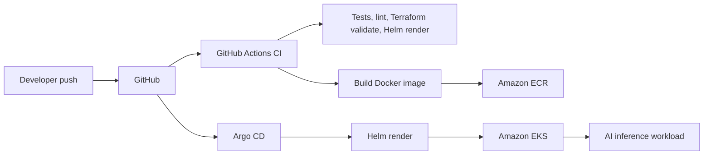

# Delivery flow

```mermaid
flowchart LR
  dev[Developer push] --> github[GitHub]
  github --> ci[GitHub Actions CI]
  ci --> tests[Tests, lint, Terraform validate, Helm render]
  ci --> build[Build Docker image]
  build --> ecr[Amazon ECR]
  github --> argocd[Argo CD]
  argocd --> helm[Helm render]
  helm --> eks[Amazon EKS]
  eks --> app[AI inference workload]
```

## Principle

GitHub Actions builds and publishes artifacts. Argo CD deploys desired state
from Git. CI does not bypass GitOps with direct `kubectl apply`.
