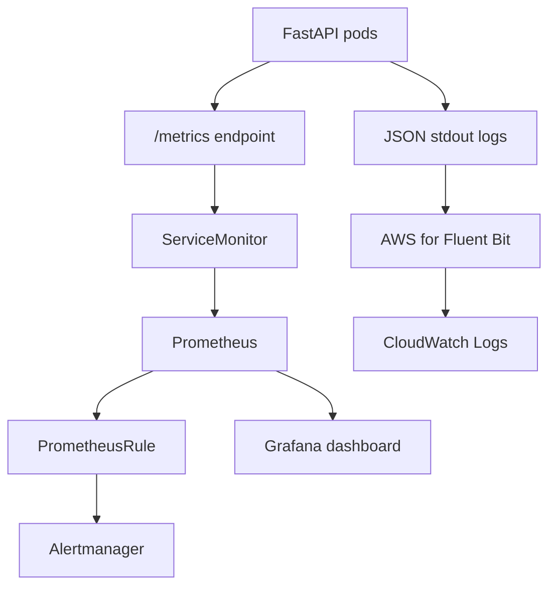

# Observability flow

```mermaid
flowchart TD
  app["FastAPI pods"] --> metrics["/metrics endpoint"]
  metrics --> serviceMonitor["ServiceMonitor"]
  serviceMonitor --> prometheus["Prometheus"]
  prometheus --> rules["PrometheusRule"]
  rules --> alertmanager["Alertmanager"]
  prometheus --> grafana["Grafana dashboard"]

  app --> stdout["JSON stdout logs"]
  stdout --> fluentBit["AWS for Fluent Bit"]
  fluentBit --> cloudwatch["CloudWatch Logs"]
```

## Signals

- Metrics answer: “Is the system healthy?”
- Alerts answer: “Does a human need to act?”
- Logs answer: “What happened?”
