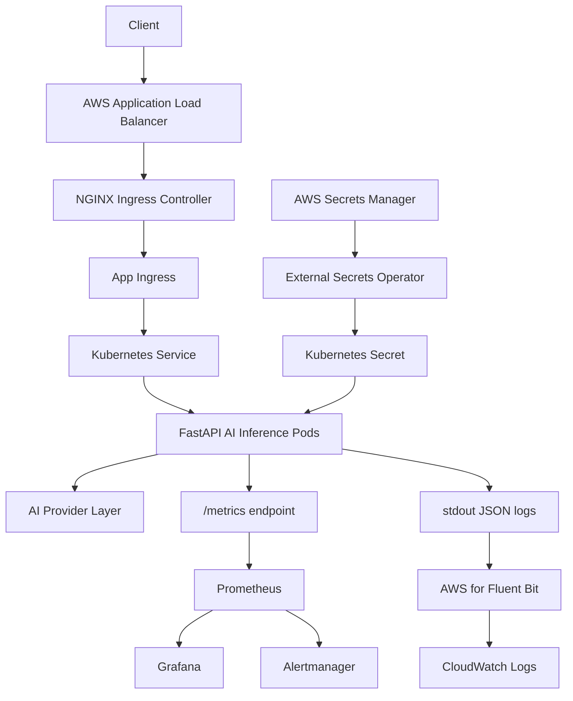

# System architecture

## Boundary notes

- The ALB is AWS-facing.
- NGINX owns in-cluster HTTP routing.
- The application Helm chart owns the app Deployment, Service, Ingress, HPA,
  PDB, ServiceMonitor, PrometheusRule, SecretStore, and ExternalSecret.
- Terraform owns AWS infrastructure and IAM.
- Argo CD reconciles Kubernetes desired state from Git.
